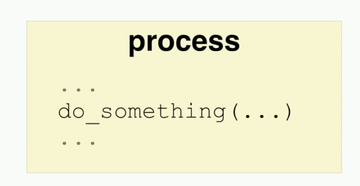
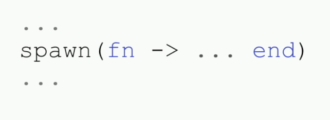
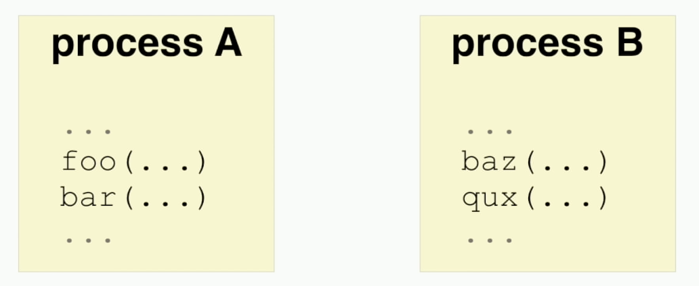
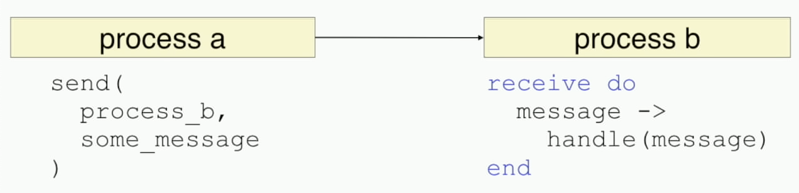
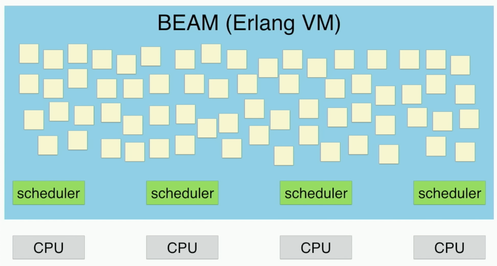
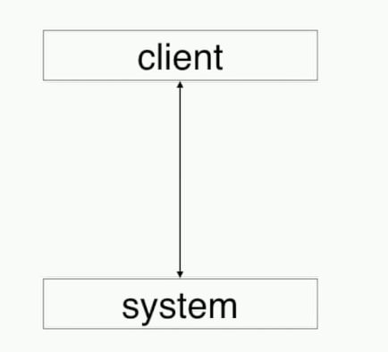
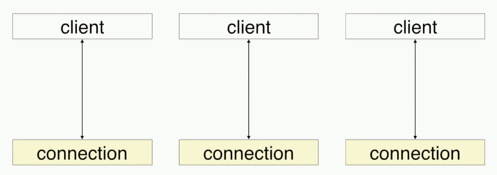
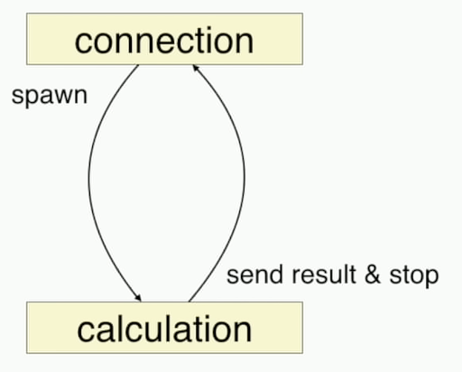
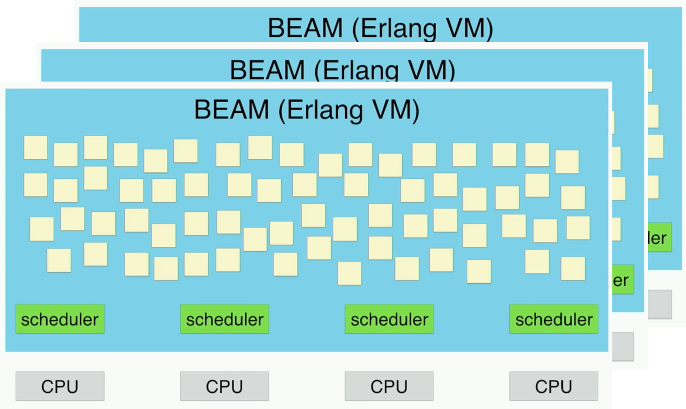
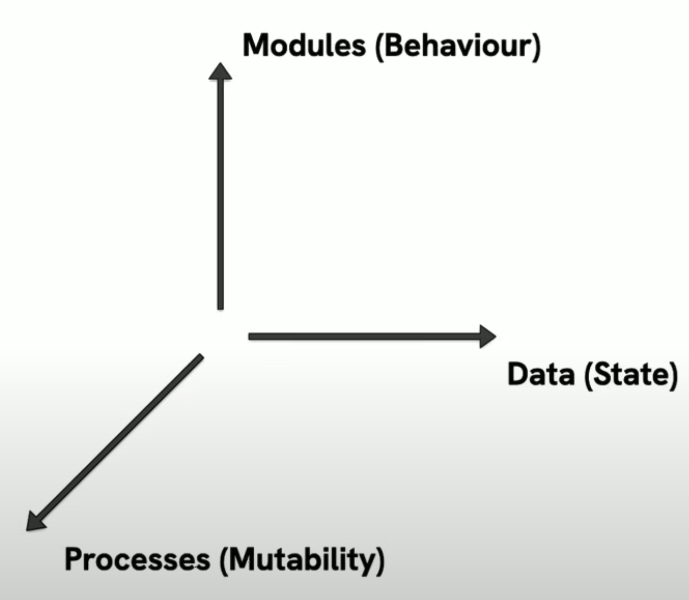

<!-- Use external markdown resource, separate slides by three newlines; vertical slides by two newlines -->

## There is NO
## perfect stack


## Imagine
- AI start up
- Logistics enterprise
- Niche embedded leader
- Telco provider


## Cisco


- 2018: ships 2 million devices per year running Erlang
- **90% of all internet traffic** going through routers and switches controlled by Erlang

<small class="extra-small">

https://www.erlang-solutions.com/blog/which-companies-are-using-erlang-and-why-mytopdogstatus/

</small>


## Whatsapp
- 2013: 54 billion messages in 24 hours
- 10 engineers server side (32 in total)
- per instance: 2 million TCP connections
- 📉 infra costs, team size

<small class="extra-small">

https://www.erlang-solutions.com/blog/which-companies-are-using-erlang-and-why-mytopdogstatus/

</small>


## Cyanview
#### Camera shading @Super Bowl
<div class="r-stack">

<div>

> Reliability is king. \
> There can be no hard failures.

- 9 employees
- biggest live events in the world

<small>

https://elixir-lang.org/blog/2025/03/25/cyanview-elixir-case/

</small>
</div>

</div>

<aside class="notes">
  - coordinate visual fidelity across two hundred cameras for Super Bowl
  - match up in color, exposure and various other visual aspects. The goal is to turn the live event broadcast into a cohesive and consistent experience
  - low-level C code and plenty of FPGA (timing requirements)
</aside>


## Other companies
- Discord (chat)
- BBC (web traffic)
- Maersk (logistics)
- PepsiCo (biz intelligence)
- Remote.com (employment)
- V7 Labs (ML pipelines)
- FarmBot (embedded)


## Erlang / Elixir
----
# BEAM




<small>

[Sasa Juric: The Soul of Erlang and Elixir](https://www.youtube.com/watch?v=JvBT4XBdoUE)

</small>



<!-- credit: Sasa Juric, https://www.youtube.com/watch?v=JvBT4XBdoUE -->



<!-- credit: Sasa Juric, https://www.youtube.com/watch?v=JvBT4XBdoUE -->



<!-- credit: Sasa Juric, https://www.youtube.com/watch?v=JvBT4XBdoUE -->



<!-- credit: Sasa Juric, https://www.youtube.com/watch?v=JvBT4XBdoUE -->


## 🍿 Demo Time
<a target="_blank" href="https://github.com/sasa1977/soul_of_erlang_and_elixir">
  sasa1977/soul_of_erlang_and_elixir
</a>



<!-- credit: Sasa Juric, https://www.youtube.com/watch?v=JvBT4XBdoUE -->



<!-- credit: Sasa Juric, https://www.youtube.com/watch?v=JvBT4XBdoUE -->



<!-- credit: Sasa Juric, https://www.youtube.com/watch?v=JvBT4XBdoUE -->



<!-- credit: Sasa Juric, https://www.youtube.com/watch?v=JvBT4XBdoUE -->


## BEAM
- powerful primitives
- fault tolerant
- introspectable
- hot code replacement
- distributed


## 🍿 Demo Time
<a target="_blank" href="https://livebook.dev/run?url=https%3A%2F%2Fraw.githubusercontent.com%2Fftes%2Felixir-jug-2025%2Frefs%2Fheads%2Fmain%2Flivebook.livemd">
  
</a>


## Uniform = Simple
- dev
- test
- deploy
- debug


# The End
<!-- .slide: data-background-image="img/bogengaudi.webp" -->
<div style="backdrop-filter: blur(8px); text-align: right; padding: 1.5rem; background-color: rgb(0 0 0 / 0.3); border-radius: 0.75 rem; width: fit-content; margin-top: 20rem; float: right;">

## <a href="https://bogengaudi.de" style="text-decoration: underline; color: orange;">BogenGaudi</a>
#### 📦 Team Events and more 📦

</div>


#### BEAM


- green: users, blue: active connections
- 40 (v)cores, 128GB mem

<small style="font-size: 0.5em;">

https://www.phoenixframework.org/blog/the-road-to-2-million-websocket-connections

</small>


### Does it all
<div style="font-size: 0.7em;">

| Technical requirement | Server A | Server B |
|--|--|--|
| HTTP server | Nginx and Phusion Passenger | BEAM |
| Request processing | Ruby on Rails | BEAM |
| Long-running requests | Go | BEAM |
| Server-wide state | Redis | BEAM |
| Persistable data | Redis and MongoDB | BEAM |
| Background jobs | Cron, Bash scripts, and Ruby | BEAM |
| Service crash recovery | Upstart | BEAM |
| PubSub | RabbitMQ | BEAM |

</div>

<small>

Sasa Juric: Erlang in Action

</small>


```ex
current_process = self()

# Spawn an Elixir process (not an operating system one!)
spawn_link(fn ->
send(current_process, {:msg, "hello world"})

# Block until the message is received
receive do
{:msg, contents} -> IO.puts(contents)
end
```


<pre class="mermaid">
sequenceDiagram
  create participant spawned
  current->spawned: spawn
  spawned->current: {:msg, "hello world"}
</pre>


<div class="r-hstack">

```ex
defmodule CounterProcess do
def loop(count) do
receive do
{:increment, caller} ->
send(caller, {:count, count + 1})
loop(count + 1)
:crash -> raise "crash"
end
end
end

counters = for i <- 1..1000 do
spawn_link(fn ->
CounterProcess.loop(i)
end)
end

for counter <- counters do
message = Enum.random(
[{:increment, self()}, :crash]
)
send(counter, message)
end

receive do
{:count, value} -> value
{:EXIT, _pid, _reason} -> :crashed
end
```

<pre class="mermaid">
sequenceDiagram
create participant c1
main->>c1: spawn
create participant c2
main->>c2: spawn
main->>c1: {:increment, main}
main->>c2: :crash
destroy c2
main--xc2: crashed
c1->>main: {:count, 2}
</pre>

</div>


## OOP vs. Elixir


- Modules: define + impl behaviour
- Data: define + impl protocol
- Processes: send + recv messages

<small>

[Gang of None? Design Patterns in Elixir](https://www.youtube.com/watch?v=agkXUp0hCW8&t=1590s)

</small>
